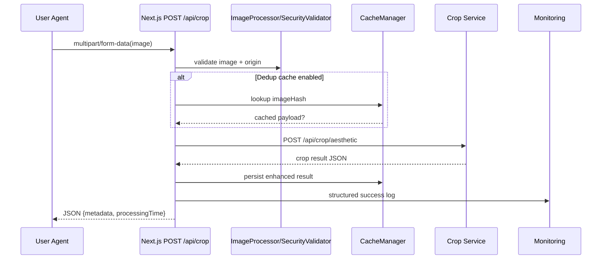
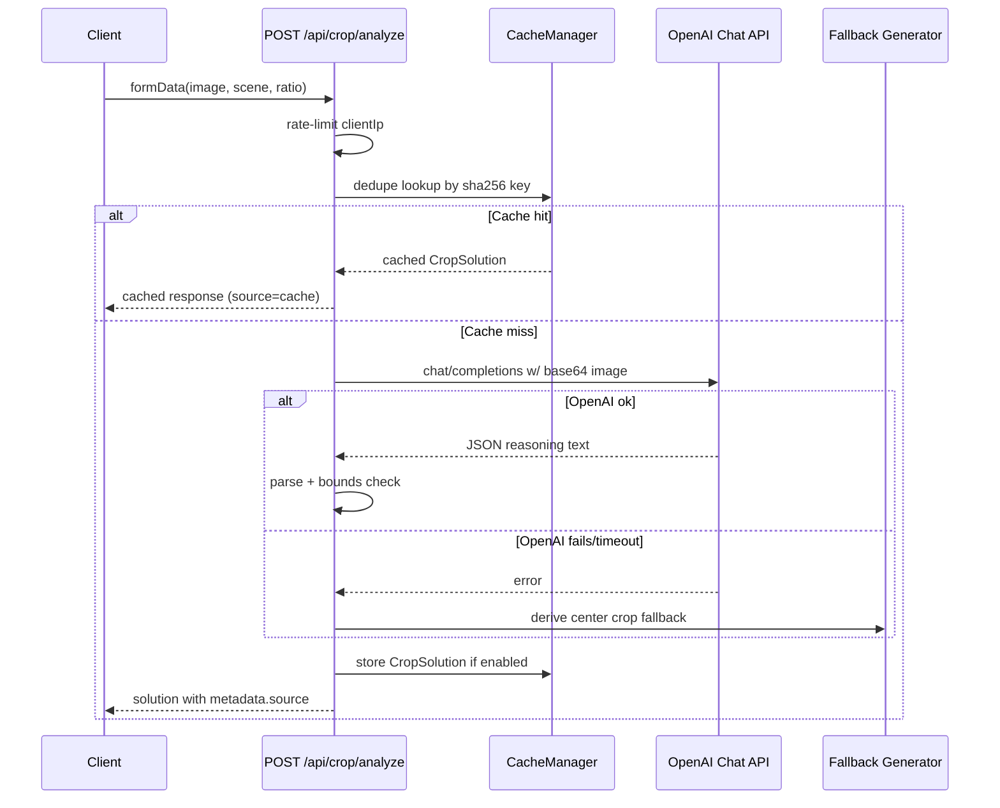
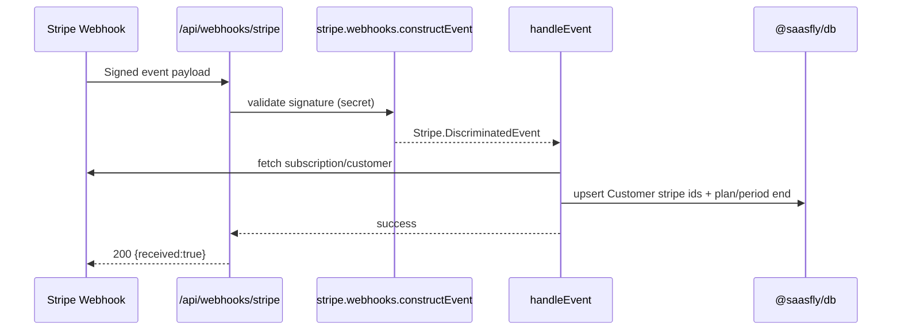

1. System purpose & top journeys (≤3)
- AI Crop Platform orchestrates image analysis and post-processing around Next.js APIs, enabling marketing users to upload assets and receive AI-generated or fallback crop guidance for social scenarios.
  - Localization-aware app dir splits marketing/auth/dashboard use cases while sharing security wrappers (apps/nextjs/src/app/[lang]/...).
- Journey: Client uploads media to POST /api/crop; Next.js proxies to crop-service, enforces validation/rate limit, enriches metadata, and returns downloadable artifacts.
  - Flow spans caching toggles, image hashing, and origin guardrails before offloading to config.cropService URL.
- Journey: Client submits POST /api/crop/analyze; route either serves cached reasoning or calls OpenAI via config-driven endpoint, then persists deduplicated insights for reuse.
  - AI reasoning is parsed for bounds correctness; fallback generator centers crops without upscaling when OpenAI fails.
- Journey: Billing lifecycle via Stripe webhook (POST /api/webhooks/stripe) updates @saasfly/db.Customer and unlocks plans for TRPC consumers (dashboard, k8s automation).
  - Dashboard TRPC queries (authRouter.mySubscription, stripeRouter.userPlans) expect webhook persistence to stay synchronized.

2. Services / modules (name → responsibility → public entry)
- Next.js marketing shell → renders localized landing/auth/dashboard flows → `apps/nextjs/src/app/[lang]/(marketing)/page.tsx` etc.
  - Shared layouts enforce language context and inject providers for marketing sections and dashboards.
- Crop proxy route → validates uploads, proxies to crop-service, caches enhanced responses → `apps/nextjs/src/app/api/crop/route.ts:32` (POST) & :201 (GET).
  - Maintains in-memory rateLimitMap and attaches X-Request-ID header per outbound call; caches results through CacheManager.
  - Structured logging toggled by config.monitoring.enableLogging ensures consistent observability payloads.
- Crop analyze route → performs OpenAI prompting with structured fallback + cache dedupe → `apps/nextjs/src/app/api/crop/analyze/route.ts:208` (POST) & :377 (GET).
  - Generates sha256-based cache key, enforces AI timeout via AbortController, and sanitizes fallback responses with metadata.source hints.
  - TODO(confirm): Original image dimensions currently hard-coded (1200x800); requires future metadata extraction to avoid inaccurate crop boxes.
- Download bridge → streams generated assets from crop-service with disposition headers → `apps/nextjs/src/app/api/download/[filename]/route.ts:7`.
  - Acts as proxy to crop-service downloads, copying content-type/disposition and surfacing localized error message on failure.
- Stripe webhook route → verifies signature, dispatches to package handler, persists subscription state → `apps/nextjs/src/app/api/webhooks/stripe/route.ts:7`.
  - Accepts both GET/POST for Stripe tester support and logs status with emoji-coded messages.
- NextAuth handler → delegates to shared auth options for session issuance → `apps/nextjs/src/app/api/auth/[...nextauth]/route.ts:6`.
  - Shared authOptions route to Clerk via @saasfly/auth, customizing sign-in path to `/login-clerk`.
- TRPC edge router → merges customer/stripe/k8s/auth drones for frontend clients → `packages/api/src/edge.ts:1` exporting `edgeRouter` consumed by app.
  - Deployed via Next.js Edge; expects createTRPCContext to supply Clerk userId with each request.
- `packages/api` stripeRouter → creates checkout/billing sessions & surfaces plan state → `packages/api/src/router/stripe.ts:1`.
  - createSession branches into billing portal reuse when plan already paid, else constructs checkout session with metadata.userId.
  - userPlans query uses db+Stripe combos to determine interval/isCanceled and fallback to free plan if missing.
- `packages/api` customerRouter → maintains Customer profile names & plan bootstrap → `packages/api/src/router/customer.ts:1`.
  - updateUserName cross-checks Clerk session identity before allowing update; insertCustomer defaults plan to SubscriptionPlan.FREE.
  - queryCustomer logs lookup attempts and returns first match by authUserId.
- `packages/api` k8sRouter → CRUD for Kubernetes cluster configs gated by user ownership → `packages/api/src/router/k8s.ts:1`.
  - createCluster enforces login, stores default network and plan, returns typed payload for UI alignment.
  - update/delete operations check cluster.authUserId to prevent cross-tenant access.
- `packages/api` authRouter → exposes subscription snapshot for dashboards → `packages/api/src/router/auth.ts:1`.
  - mySubscription returns plan/endsAt pair with `noStore()` to disable Next.js caching around sensitive billing info.
- `@saasfly/auth` → wraps Clerk session retrieval with admin flag inference → `packages/auth/clerk.ts:1` & `packages/auth/index.ts:1`.
  - getSessionUser mutates sessionClaims.user.isAdmin by comparing env.ADMIN_EMAIL list.
  - Exports authOptions referencing login page for NextAuth integration.
- `@saasfly/db` → Prisma-kysely bridge exposing enums + Kysely client → `packages/db/index.ts:1` & `packages/db/prisma/schema.prisma:1`.
  - Schema defines Customer, K8sClusterConfig, and status enum with indexes on authUserId for multi-tenant queries.
  - Kysely client via @vercel/postgres-kysely powers router queries/mutations without explicit connection pooling config.
- `@saasfly/stripe` → initializes Stripe client + webhook dispatcher, maps events to DB → `packages/stripe/src/index.ts:1`, `packages/stripe/src/webhooks.ts:1`.
  - handleEvent updates Customer records on checkout completion and invoice success, deriving plan via getSubscriptionPlan.
  - Stripe.DiscriminatedEvent type augmentation enumerates event union for downstream safety.
- `ImageProcessor` → enforces upload policy, compresses, hashes, extracts metadata → `apps/nextjs/src/lib/utils/image.ts:1`.
  - generateImageHash provides deterministic dedupe key; compressImage avoids upscaling by gating on max dimensions.
- `CacheManager` → memory/redis hybrid dedupe cache keyed per image hash → `apps/nextjs/src/lib/utils/cache.ts:1`.
  - Provides get/set/delete with TTL enforcement; Redis init currently TODO but logs fallback when unavailable.
- `SecurityValidator` → validates env, origins, sanitizes logs for crop APIs → `apps/nextjs/src/lib/utils/security.ts:1`.
  - validateEnvironmentOnStartup surfaces fatal misconfigurations (API keys, secrets) and warns on lax rate limits.
  - maskSensitiveData recursively strips secrets before logging security events.
- Config registry → centralizes env-driven toggles for AI, caching, monitoring → `apps/nextjs/src/lib/config.ts:1`.
  - Rate limit + cache toggles inform both proxy and analyze routes; security.corsOrigins guards origin checks.
- Auth proxy (Nitro) → provides GitHub OAuth fallback via @auth/core → `apps/auth-proxy/routes/[...auth].ts:1`.
  - Configured via env AUTH_SECRET / redirect proxy; reuses GitHub provider for multi-environment login.
- `packages/api` transformer → normalizes Dinero pricing serialization via superjson → `packages/api/src/transformer.ts:1`.
  - Ensures TRPC responses preserve Dinero math helpers across client/server boundaries.
- `packages/api` env guard → validates Stripe + Clerk secrets for edge execution → `packages/api/src/env.mjs:1`.
  - Uses t3 env schema to fail fast when webhook secrets missing in deployment.
- `packages/api` type exports → provides RouterInputs/RouterOutputs helpers → `packages/api/src/index.ts:1`.
  - Encourages typed client usage preventing drift between TRPC server and consumer.
- Common subscription catalog → surfaces plan metadata + Stripe price ids → `packages/common/src/subscriptions.ts:1`.
  - pricingData shapes UI plan cards, aligning stripeIds with env-driven price ids for PRO/BUSINESS plans.

3. Global invariants
- SecurityValidator.isValidOrigin enforces config.security.corsOrigins; unexpected origins trigger warn-level audit logs and 403 response.
  - TODO(confirm): align config.security.corsOrigins with deployed frontend domains per environment.
- Image uploads must satisfy `config.image.maxSize` and MIME allowlist before hitting downstream services (`ImageProcessor.validateImage`).
  - Violations trigger 400 responses; validation logic reused by crop proxy/analyze endpoints.
- Rate limiting per `config.rateLimit.max` requests per window is enforced across crop proxy/analyze; requests beyond the window must return HTTP 429.
  - Rate maps reset when window elapses, ensuring fairness; TODO(confirm) global store may need Redis to avoid multi-node drift.
- Stripe customer records remain authoritative for plan state: updates always write `stripePriceId`, `stripeCurrentPeriodEnd`, and `plan` to `Customer` (`packages/stripe/src/webhooks.ts`).
  - handleEvent ensures subscription metadata.userId exists; absence raises error halting persistence.
- protectedProcedure requires `ctx.userId`; TRPC mutations/queries must only run with authenticated Clerk sessions (`packages/api/src/trpc.ts`).
  - Middleware throws TRPCError.UNAUTHORIZED, preventing state changes without Clerk auth context.
- TODO(confirm): Cache dedupe requires `config.performance.enableDedupCache` implying Redis readiness if `config.cache.enabled`; otherwise memory cache may be sole store.
  - Memory cache TTL uses milliseconds yet set() multiplies TTL by 1000; confirm mismatch vs config.cache.ttl (seconds).
- K8s cluster mutations must only operate on rows owned by ctx.userId; unauthorized access throws TRPCError.FORBIDDEN (`packages/api/src/router/k8s.ts`).
  - TODO(confirm): evaluate concurrency on update/delete where cluster.authUserId may race with webhook-driven automation.
- NextAuth/Clerk integration depends on env schema in `packages/auth/env.mjs`; missing secrets should fail fast via createEnv().
  - TODO(confirm): Document fallback behavior for local development when optional Clerk values absent.

4. Dataflow (Mermaid sequence)

- Downstream crop-service expected at `config.cropService.url`; missing service bubbles 500 with localized fallback message.

- SecurityValidator.logSecurityEvent traces cache hits/misses when monitoring enabled to audit AI usage.
- TODO(confirm): integrate actual Redis client in CacheManager for production dedupe persistence.

- DB writes rely on `stripe.subscriptions.retrieve` metadata.userId; absence triggers thrown Error halting webhook ack.
- TODO(confirm): add idempotency guard on webhook updates to avoid duplicate writes when Stripe retries events.

5. Entry index (for jump)
- packages/api/src/transformer.ts:1 — Registers superjson custom serializer for Dinero pricing objects.
- packages/api/src/env.mjs:1 — Validates TRPC server env for Stripe secrets on edge runtime.
- packages/api/src/trpc.ts:27 — errorFormatter attaches flattened Zod errors to TRPC responses.
- packages/api/src/root.ts:1 — merges edgeRouter; exported AppRouter powers client typing.
- packages/api/src/index.ts:1 — exposes RouterInputs/Outputs helpers for frontend inference.
- packages/stripe/src/plans.ts:1 — Maps Stripe price ids to SubscriptionPlan enum for webhook reconciliation.
- packages/auth/env.mjs:1 — Guards required Clerk/NextAuth env variables.
- apps/nextjs/src/lib/utils/cache.ts:9 — CacheManager init toggles Redis support with logging fallback.
- apps/nextjs/src/lib/utils/security.ts:52 — sanitizeInput prevents injection in textual contexts.
- apps/nextjs/src/lib/config.ts:5 — openai config centralizes baseUrl/apiKey/model/timeouts.
- apps/nextjs/src/lib/utils/image.ts:44 — compressImage avoids upscaling before returning base64.
- apps/nextjs/src/lib/utils/cache.ts:55 — set() multiplies TTL by 1000; review alignment with config.ttl units.
- apps/nextjs/src/lib/utils/security.ts:93 — maskSensitiveData recursively redacts secrets in structured logs.
- apps/auth-proxy/routes/[...auth].ts:9 — Configures GitHub provider with env-driven client credentials.
- contracts/README.md:1 — Declares directory as canonical API/事件契约 repository; awaiting specs.
- packages/db/prisma/schema.prisma:13 — Defines SubscriptionPlan enum (FREE/PRO/BUSINESS) consumed by routers.
- packages/db/prisma/schema.prisma:60 — Customer model fields persisted by Stripe webhook + TRPC flows.
- packages/db/prisma/schema.prisma:101 — K8sClusterConfig schema capturing multi-tenant cluster entries.
- apps/nextjs/src/lib/utils/cache.ts:74 — cleanupMemoryCache prunes expired items during writes.
- apps/nextjs/src/lib/utils/security.ts:119 — logSecurityEvent writes sanitized audit logs respecting config.monitoring.enableLogging.
- modules/README.md:1 — Mandates MODULE_FACTS.md per module summarizing invariants.
- apps/nextjs/src/app/[lang]/(marketing)/page.tsx:1 — Marketing landing entry orchestrating hero components per locale.
- apps/nextjs/src/app/[lang]/(auth)/login/page.tsx:1 — Clerk login route bridging to shared layouts.
- apps/nextjs/src/app/[lang]/(dashboard)/dashboard/page.tsx:1 — Main dashboard entry calling TRPC routers for subscription state.
- apps/nextjs/src/app/admin/(dashboard)/dashboard/page.tsx:1 — Admin dashboard entry; relies on admin flag from @saasfly/auth.
- apps/auth-proxy/routes/[...auth].ts:1 — Auth proxy bridging GitHub OAuth for edge runtime.

- apps/nextjs/src/app/api/crop/route.ts:32 — POST /api/crop proxy pipeline with validation/cache/fetch.
- apps/nextjs/src/app/api/crop/route.ts:201 — GET /api/crop status/feature summary.
- apps/nextjs/src/app/api/crop/analyze/route.ts:208 — POST /api/crop/analyze orchestrating OpenAI + fallback.
- apps/nextjs/src/app/api/crop/analyze/route.ts:377 — GET /api/crop/analyze health snapshot.
- apps/nextjs/src/app/api/download/[filename]/route.ts:7 — GET /api/download/:filename streaming from crop-service.
- apps/nextjs/src/app/api/webhooks/stripe/route.ts:7 — Stripe webhook handler exporting GET/POST.
- apps/nextjs/src/app/api/auth/[...nextauth]/route.ts:6 — NextAuth catch-all using shared authOptions.
- packages/api/src/edge.ts:1 — Root TRPC router combining domain routers for edge deployment.
- packages/api/src/router/stripe.ts:24 — protectedProcedure createSession for Stripe checkout/billing.
- packages/api/src/router/stripe.ts:74 — userPlans query deriving paid plan metadata.
- packages/api/src/router/customer.ts:17 — updateUserName mutation enforcing owner match.
- packages/api/src/router/customer.ts:47 — queryCustomer retrieving Customer rows.
- packages/api/src/router/k8s.ts:21 — getClusters filtering by authUserId.
- packages/api/src/router/k8s.ts:37 — createCluster mutation with SubscriptionPlan default.
- packages/api/src/router/k8s.ts:71 — updateCluster mutation verifying ownership.
- packages/api/src/router/k8s.ts:97 — deleteCluster marketing cluster deletion guard.
- packages/api/src/router/auth.ts:6 — mySubscription query surface for dashboards.
- packages/stripe/src/webhooks.ts:7 — handleEvent dispatcher for checkout + invoice cycles.
- apps/auth-proxy/routes/[...auth].ts:1 — Auth proxy bridging GitHub OAuth for edge runtime.
